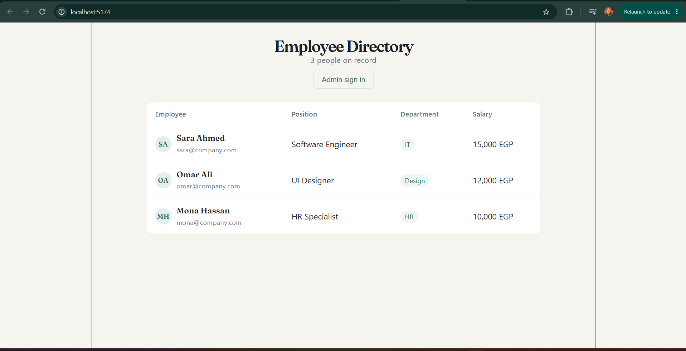
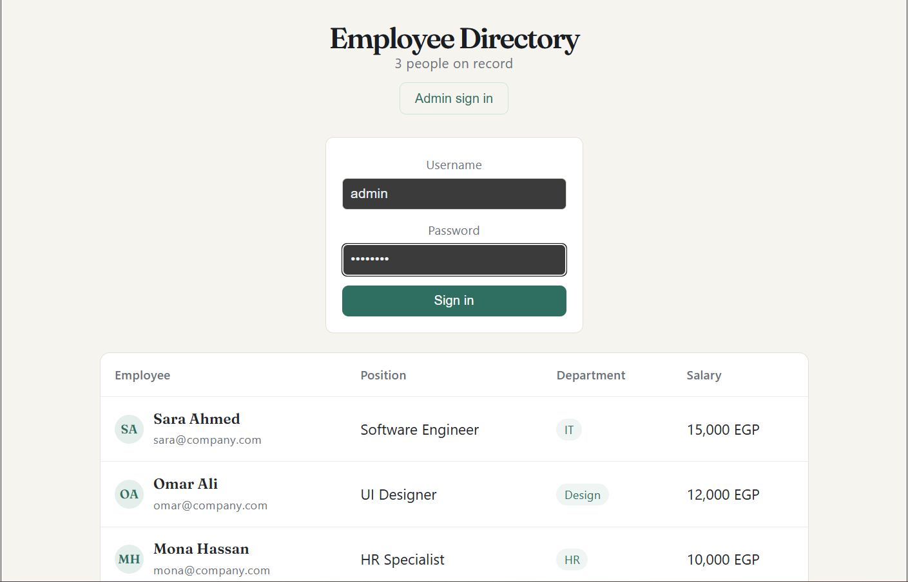
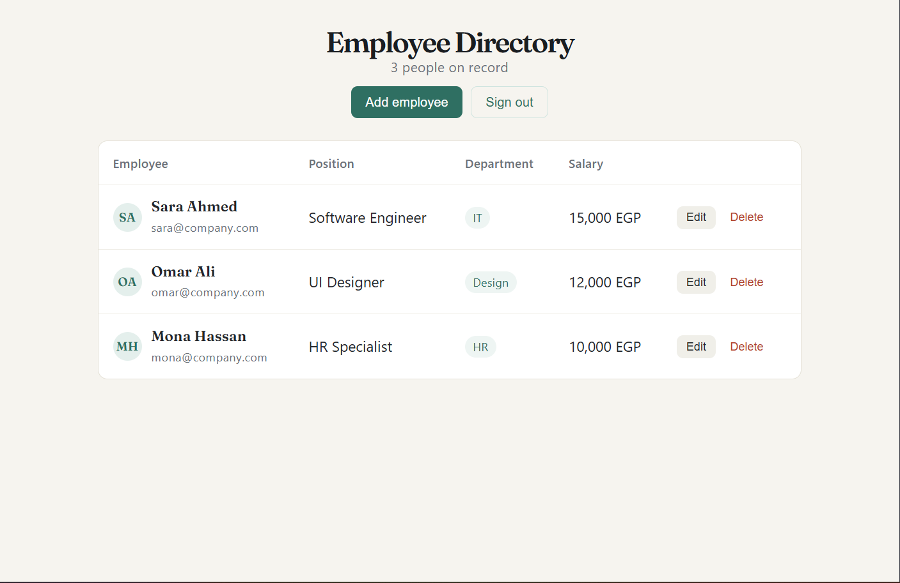
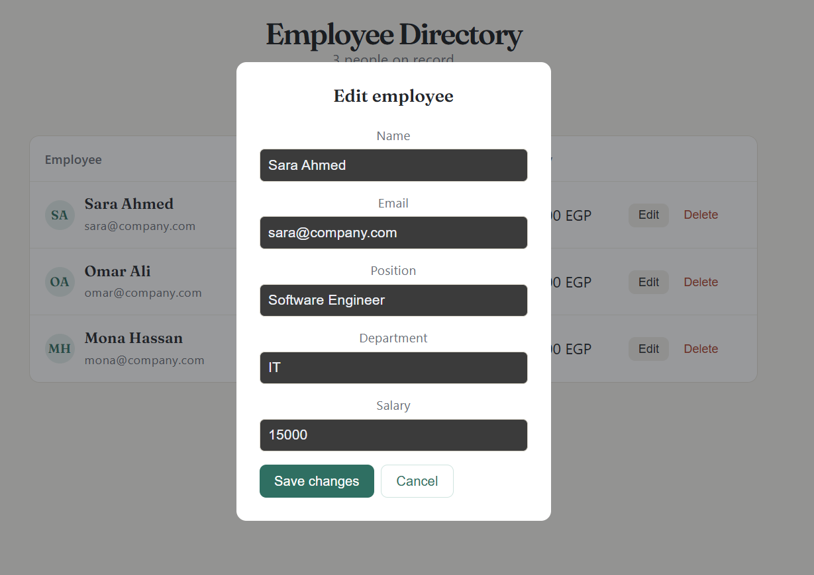

# Employee Management System — AVIP Task 2

A full stack CRUD application for managing employee records, built with React (frontend) and Node.js/Express + SQLite (backend). Includes admin authentication to protect create/update/delete operations.

## Tech Stack

- Frontend: React (Vite)
- Backend: Node.js, Express
- Database: SQLite (via better-sqlite3)
- Auth: JWT (JSON Web Token)

## Features

- View all employees (public)
- Add, edit, and delete employees (admin only, protected by JWT)
- Server-side validation for required fields and salary format
- Data persisted in a SQLite database with seed data on first run
- Responsive UI

## API Endpoints

| Endpoint          | Method | Auth Required | Description                          |
|-------------------|--------|----------------|----------------------------------------|
| `/`               | GET    | No             | Health check                           |
| `/login`          | POST   | No             | Admin login, returns JWT token         |
| `/employees`      | GET    | No             | List all employees                     |
| `/employees/:id`  | GET    | No             | Get one employee by id                 |
| `/employees`      | POST   | Yes (Bearer)   | Create a new employee                  |
| `/employees/:id`  | PUT    | Yes (Bearer)   | Update an existing employee            |
| `/employees/:id`  | DELETE | Yes (Bearer)   | Delete an employee                     |

### Example: Admin Login
POST /login
Content-Type: application/json

{
"username": "admin",
"password": "admin123"
}


Response:
```json
{
  "message": "Login successful",
  "token": "eyJhbGciOiJIUzI1NiIs..."
}
```

### Example: Create Employee (Authenticated Request)
POST /employees
Content-Type: application/json
Authorization: Bearer <token>

{
"name": "Test User",
"email": "test@company.com",
"position": "Tester",
"department": "QA",
"salary": 9000
}


Response:
```json
{
  "id": 4,
  "name": "Test User",
  "email": "test@company.com",
  "position": "Tester",
  "department": "QA",
  "salary": 9000
}
```

## Running Locally

### Backend
cd backend
npm install
cp .env.example .env # then fill in your own JWT_SECRET and admin credentials
node server.js

Runs on `http://localhost:5001`

### Frontend
cd frontend
npm install
npm run dev

Runs on `http://localhost:5173` (or the port Vite assigns)

## Demo

See screenshots below showing the employee directory and the admin flow (add, edit, delete).



